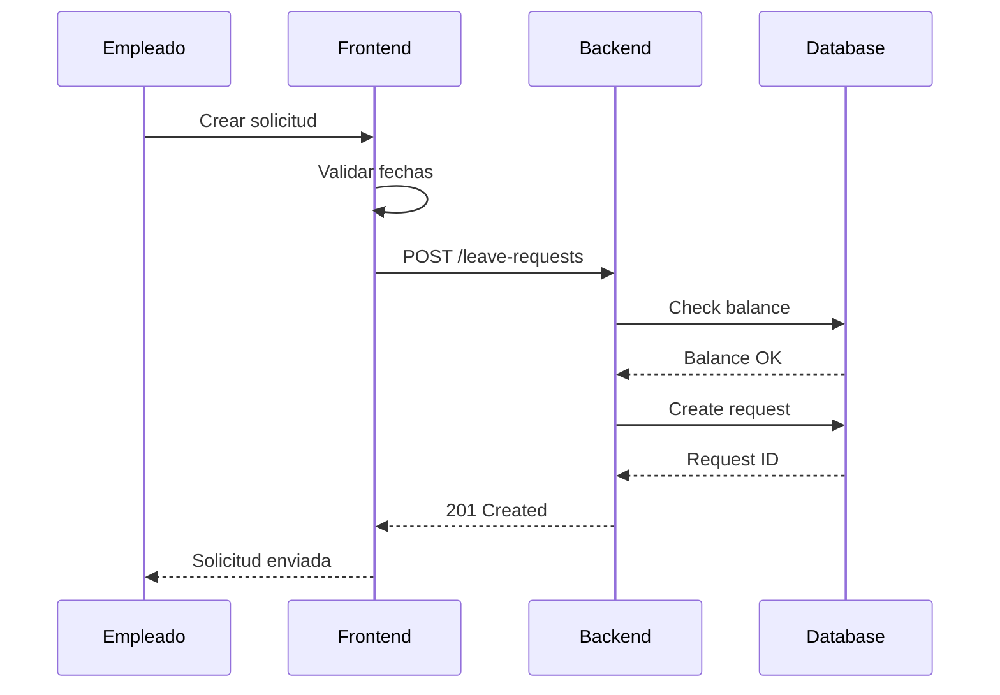
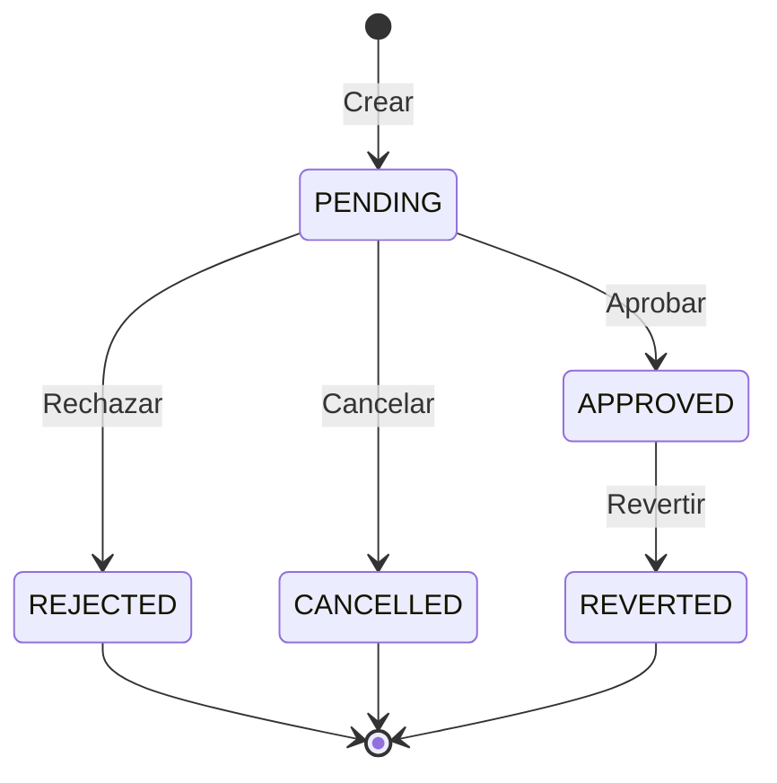

# Documentation Generator Skill

Skill especializado en generación automática de documentación técnica, guías de usuario, API docs y documentación de arquitectura.

## Tipos de Documentación

### 1. Documentación de API (OpenAPI)
```yaml
# Generación automática desde código FastAPI
openapi: 3.0.3
info:
  title: YuKyuDATA API
  description: API para gestión de vacaciones pagadas (有給休暇)
  version: 1.0.0
  contact:
    name: YuKyu Support
    email: support@yukyu.example.com

servers:
  - url: http://localhost:8000
    description: Desarrollo local
  - url: https://api.yukyu.example.com
    description: Producción

paths:
  /api/employees:
    get:
      summary: Obtener lista de empleados
      description: |
        Retorna lista de empleados con datos de vacaciones.
        Soporta filtrado por año fiscal.
      operationId: getEmployees
      parameters:
        - name: year
          in: query
          description: Año fiscal (ej. 2025)
          schema:
            type: integer
            example: 2025
      responses:
        '200':
          description: Lista de empleados
          content:
            application/json:
              schema:
                type: array
                items:
                  $ref: '#/components/schemas/Employee'
        '401':
          $ref: '#/components/responses/Unauthorized'

components:
  schemas:
    Employee:
      type: object
      properties:
        employee_num:
          type: string
          description: Número de empleado
          example: "001"
        name:
          type: string
          description: Nombre completo
          example: "田中太郎"
        granted:
          type: number
          description: Días otorgados
          example: 20
        used:
          type: number
          description: Días usados
          example: 10
        balance:
          type: number
          description: Días restantes
          example: 10
        year:
          type: integer
          description: Año fiscal
          example: 2025
```

### 2. README Template
```markdown
# YuKyuDATA - Sistema de Gestión de Vacaciones 有給休暇管理

Sistema integral de gestión de vacaciones pagadas conforme a la ley laboral japonesa.

## Características Principales

- **Cumplimiento Legal**: Labor Standards Act Article 39
- **Obligación 5 Días**: Verificación automática de uso mínimo
- **LIFO Deduction**: Deducción optimizada para proteger días antiguos
- **Reportes**: Libro anual conforme a normativa (年次有給休暇管理簿)

## Quick Start

```bash
# Instalar dependencias
pip install -r requirements.txt

# Iniciar servidor
python -m uvicorn main:app --reload

# Acceder
open http://localhost:8000
```

## Documentación

- [Guía de Usuario](docs/USER_GUIDE.md)
- [API Reference](docs/API.md)
- [Arquitectura](docs/ARCHITECTURE.md)
- [Contribuir](CONTRIBUTING.md)

## Stack Tecnológico

| Componente | Tecnología |
|------------|------------|
| Backend | FastAPI (Python) |
| Frontend | Vanilla JS + CSS |
| Database | SQLite / PostgreSQL |
| Charts | Chart.js, ApexCharts |

## Licencia

MIT License - Ver [LICENSE](LICENSE)
```

### 3. Guía de Usuario
```markdown
# Guía de Usuario - YuKyuDATA

## 1. Dashboard

### KPIs Principales
- **Total Empleados**: Número de empleados activos
- **Tasa de Uso**: Porcentaje de vacaciones consumidas
- **Días Promedio**: Media de días usados por empleado
- **Compliance**: Estado de cumplimiento 5 días

### Navegación
1. Click en el menú lateral para cambiar vistas
2. Use el selector de año para cambiar período
3. El botón "Sync" actualiza datos desde Excel

## 2. Gestión de Solicitudes

### Crear Solicitud
1. Ir a "Solicitudes"
2. Click "Nueva Solicitud"
3. Completar formulario:
   - Fecha inicio
   - Fecha fin
   - Tipo (día completo, medio día, por horas)
4. Click "Enviar"

### Aprobar Solicitud (Managers)
1. Ver solicitudes pendientes
2. Click en solicitud
3. Revisar detalles
4. Click "Aprobar" o "Rechazar"

## 3. Compliance

### Verificación 5 Días
- Los empleados con 10+ días **deben** usar mínimo 5 días/año
- El sistema muestra alertas:
  - 🟢 Conforme: Usó 5+ días
  - 🟡 En Riesgo: Usó <5 días, quedan meses
  - 🔴 No Conforme: Usó <5 días, fin de año

### Días Próximos a Expirar
- Los días expiran 2 años después de otorgamiento
- El sistema alerta 3 meses antes de expiración

## 4. Exportar Datos

### Formatos Disponibles
- Excel (.xlsx)
- CSV
- PDF (reportes)

### Tipos de Exportación
1. **Lista de Empleados**: Datos actuales
2. **Solicitudes Aprobadas**: Historial
3. **Libro Anual**: Formato legal (年次有給休暇管理簿)
```

### 4. Documentación Técnica
```markdown
# Arquitectura Técnica - YuKyuDATA

## Diagrama de Componentes

```
┌────────────────────────────────────────────────────────────┐
│                     Frontend (SPA)                          │
│  ┌─────────┐ ┌─────────┐ ┌─────────┐ ┌─────────┐          │
│  │Dashboard│ │Employees│ │Requests │ │Analytics│          │
│  └────┬────┘ └────┬────┘ └────┬────┘ └────┬────┘          │
│       │          │          │          │                    │
│       └──────────┴──────────┴──────────┘                    │
│                         │                                    │
│                    DataService                               │
│                         │                                    │
└─────────────────────────┼────────────────────────────────────┘
                          │ HTTP/REST
┌─────────────────────────┼────────────────────────────────────┐
│                    FastAPI Backend                           │
│  ┌─────────┐ ┌─────────┐ ┌─────────┐ ┌─────────┐           │
│  │Auth     │ │Employees│ │Leave    │ │Analytics│           │
│  │Middleware│ │Routes   │ │Routes   │ │Routes   │           │
│  └────┬────┘ └────┬────┘ └────┬────┘ └────┬────┘           │
│       │          │          │          │                    │
│       └──────────┴──────────┴──────────┘                    │
│                         │                                    │
│              ┌──────────┴──────────┐                        │
│              │   Service Layer     │                        │
│              │  fiscal_year.py     │                        │
│              │  excel_service.py   │                        │
│              └──────────┬──────────┘                        │
│                         │                                    │
│              ┌──────────┴──────────┐                        │
│              │   Data Access       │                        │
│              │   database.py       │                        │
│              └──────────┬──────────┘                        │
│                         │                                    │
└─────────────────────────┼────────────────────────────────────┘
                          │
┌─────────────────────────┼────────────────────────────────────┐
│                    Data Layer                                │
│  ┌─────────────────┐  ┌─────────────────┐                   │
│  │    SQLite       │  │     Excel       │                   │
│  │   yukyu.db      │  │  有給休暇管理.xlsm │                   │
│  └─────────────────┘  └─────────────────┘                   │
└─────────────────────────────────────────────────────────────┘
```

## Flujo de Datos

### Sincronización Excel → DB
1. Usuario click "Sync"
2. `excel_service.parse_excel_file()` lee Excel
3. Detección automática de headers
4. Mapeo de columnas japonés → inglés
5. `database.save_employees()` guarda en SQLite
6. Frontend recibe confirmación

### Solicitud de Vacaciones
1. Usuario envía formulario
2. Validación en frontend (fechas, días)
3. POST `/api/leave-requests`
4. Validación en backend (balance)
5. Crear registro en `leave_requests`
6. Manager aprueba
7. `apply_lifo_deduction()` deduce días
8. Actualizar `employees.used`
9. Emitir evento para audit log

## Base de Datos

### Esquema ER

```
┌─────────────────┐       ┌─────────────────┐
│   employees     │       │  leave_requests │
├─────────────────┤       ├─────────────────┤
│ PK id           │       │ PK id           │
│ employee_num    │◄──────│ employee_num    │
│ name            │       │ start_date      │
│ granted         │       │ end_date        │
│ used            │       │ days_requested  │
│ balance         │       │ status          │
│ year            │       │ approved_by     │
└─────────────────┘       └─────────────────┘
        │
        │ 1:1
        ▼
┌─────────────────┐
│     genzai      │
├─────────────────┤
│ PK id           │
│ employee_num    │
│ dispatch_name   │
│ hourly_wage     │
│ hire_date       │
└─────────────────┘
```

### Índices
```sql
CREATE INDEX idx_emp_year ON employees(year);
CREATE INDEX idx_emp_num ON employees(employee_num);
CREATE INDEX idx_lr_status ON leave_requests(status);
CREATE INDEX idx_genzai_status ON genzai(status);
```
```

### 5. Docstrings Automáticos
```python
def generate_docstring(function_code: str) -> str:
    """
    Genera docstring para una función Python.

    Args:
        function_code: Código fuente de la función

    Returns:
        Docstring en formato Google style

    Example:
        >>> code = "def add(a: int, b: int) -> int:\n    return a + b"
        >>> print(generate_docstring(code))
        '''
        Add two integers.

        Args:
            a: First integer
            b: Second integer

        Returns:
            Sum of a and b
        '''
    """
    # Parse function signature
    # Analyze parameters and return type
    # Generate description from function name
    # Format as Google-style docstring
    pass

# Ejemplo de output
def calculate_granted_days(seniority_years: float) -> int:
    """
    Calculate vacation days granted based on employee seniority.

    Implements Japanese Labor Standards Act Article 39 grant table.

    Args:
        seniority_years: Years of continuous employment (e.g., 0.5 for 6 months)

    Returns:
        Number of vacation days granted (10-20 days)

    Raises:
        ValueError: If seniority_years is negative

    Examples:
        >>> calculate_granted_days(0.5)
        10
        >>> calculate_granted_days(6.5)
        20

    Note:
        - Minimum: 10 days at 6 months
        - Maximum: 20 days at 6.5+ years
        - Requires 80% attendance rate
    """
```

## Generación de Diagramas

### Mermaid.js
```markdown
# Workflow de Solicitud




```

## Templates de Documentación

### Changelog
```markdown
# Changelog

## [1.0.0] - 2026-01-09

### Added
- Sistema completo de gestión de vacaciones
- Verificación de cumplimiento 5 días
- Deducción LIFO automática
- Dashboard con KPIs
- Exportación a Excel/CSV

### Changed
- Migración de Flask a FastAPI
- Nuevo diseño con glassmorphism

### Fixed
- Cálculo correcto de carry-over
- Bug en año fiscal japonés

### Security
- Implementación de JWT
- Rate limiting 100 req/min
- XSS prevention
```

### Contributing Guide
```markdown
# Contributing Guide

## Getting Started

1. Fork el repositorio
2. Clone tu fork
3. Crear branch: `git checkout -b feature/nombre`
4. Instalar: `pip install -r requirements-dev.txt`

## Development

### Estilo de Código
- Python: PEP 8, Black formatter
- JavaScript: ESLint, Prettier
- CSS: BEM naming, variables CSS

### Tests
```bash
# Antes de commit
pytest tests/ -v
npx jest
```

### Commit Messages
```
<type>(<scope>): <description>

Types: feat, fix, docs, style, refactor, test, chore
Scope: api, frontend, db, auth, compliance
```

## Pull Request

1. Update CHANGELOG.md
2. Asegurar tests pasan
3. Describir cambios
4. Link a issue si aplica
```

## Comandos de Generación

```bash
# API Docs (OpenAPI)
python -c "from main import app; import json; print(json.dumps(app.openapi()))" > openapi.json

# Docstrings coverage
pip install interrogate
interrogate -v . --fail-under 80

# README badges
[]()
[]()

# Generate HTML docs
pip install pdoc
pdoc --html --output-dir docs/ .
```

---

**Principio Guía:** "Documenta para tu yo del futuro. Si no está documentado, no existe."
